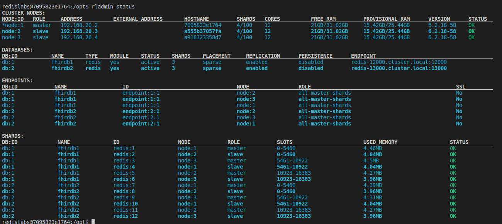

# Key Slot Utility  

## Contents
1.  [Summary](#summary)
2.  [Features](#features)
3.  [Prerequisites](#prerequisites)
4.  [Installation](#installation)
5.  [Usage](#usage)

## Summary <a name="summary"></a>
This is a utility for determining the key slot and node location for a given key string.  This utility replicates the expected hash behavior for Redis OSS documented [here](https://redis.io/docs/reference/cluster-spec/).  Redis Enterprise hash behavior is currently inconsistent with OSS.  This inconsistency is on roadmap to be corrected.  This utility will yield correct OSS hash slots now and will yield correct RE slots in the future when that RE correction is in place.   

## Features <a name="features"></a>
- Calculate key slot based on the Redis hash slot algorithm
- Interrogates a Redis Enterprise cluster via REST API to determine the node assignment for a hash slot
- Can be compiled to a single binary via Nuitka 

## Prerequisites <a name="prerequisites"></a>
- Python

## Installation <a name="installation"></a>
1. Clone this repo.

2.  Install Python requirements
```bash
pip install -r requirements.txt
```

3.  Optional.  Compile Python app to an executable (binary)
```bash
./compile.sh
```

## Usage <a name="usage"></a>
### Options
- --url. Redis REST API base URL
- --user.  Redis REST API user name
- --password. Redis REST API user password
- --dbid.  Database ID (int) of the db to be queried for node/slot assignments  

### Examples for the given RE cluster
  

### Key = foo
#### Python
```bash
python3 keyslot.py --url https://localhost:19443 --user redis@redis.com --password redis --dbid 1 foo
```
#### Binary
```bash
./ks --url https://localhost:19443 --user redis@redis.com --password redis --dbid 1 foo
```
#### Result
```bash
{'key': 'foo', 'slot': 12182, 'node': 2}
```  

### Key = foo{bar}
#### Python
```bash
python3 keyslot.py --url https://localhost:19443 --user redis@redis.com --password redis --dbid 2 foo{bar}
```
#### Binary
```bash
./ks --url https://localhost:19443 --user redis@redis.com --password redis --dbid 2 foo{bar}
```
#### Result
```bash
{'key': 'bar', 'slot': 5061, 'node': 1}
```

### Key = foo{}{bar}
#### Python
```bash
python3 keyslot.py --url https://localhost:19443 --user redis@redis.com --password redis --dbid 2 foo{}{bar}
```
#### Binary
```bash
./ks --url https://localhost:19443 --user redis@redis.com --password redis --dbid 2 foo{}{bar}
```
#### Result
```bash
{'key': 'foo{}{bar}', 'slot': 8363, 'node': 3}
```


